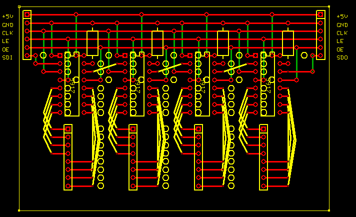
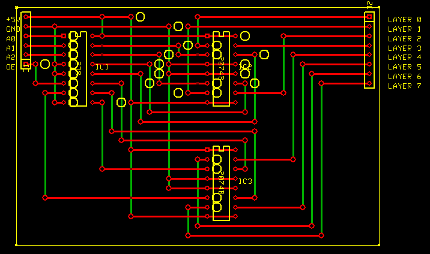
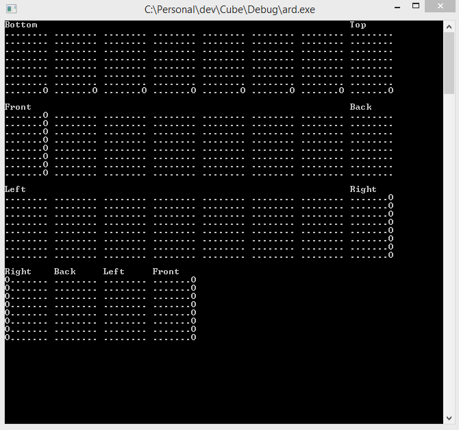

# LED Cube
This is the software repository behind James Thorpe's LED Cube.

## Hardware

The control boards are built on stripboard, the layouts of which were designed using features of [Express PCB](https://www.expresspcb.com/).  In the diagrams below, there are various components:
 - Red lines (top layer in Express PCB): Unbroken strips on the stripboard
 - Green lines (bottom layer in Express PCB): wire links
 - Yellow lines (silkscreen layer): flying-lead style links
 - Yellow circles (silkscreen layer): indicate where the stripboard strips must be cut
 - Yellow components (silkscreen layer): Position of actual components

There are 3 boards in total, in addition to the arduino itself.  Two identical boards provide 64 total sinks for the LEDs, while the third provides the source for the layers.  

#### Sinks

The two sink boards are chained one after the other, with the first being driven by the arduino.  They consist of 4 identical sub-circuits which use a TLC5917 to control the sinking of current from an 8-way header.  The control of these ICs is done via shifting data in representing which pins are active.  Each IC also has a "serial out" pin, allowing data to cascase from one IC to another.  By sending 8 bytes (enough to represent an entire layer of the cube) serially, all 8 ICs across both boards can easily be controlled.  There are further lines to allow simultaneous control of the Latch Enable and Output Enable pins, although the current software revision has the Output Enable always enabled, with the overall on/off control of the cube currently being done through the source board.

#### Source

The source for the power needs to be capable of driving up to 64 LEDs in each layer at any given time.  This puts the current needs way beyond what the arduino can supply, so the power for each layer comes from the output of a ULN2074B (a Quad Darlington Pair IC).  To help cut down on the number of pins used on the arduino so more are free for any potential future use, a 74HC238 3-to-8 line decoder is used to demux 3 pins to 8.  A 4th pin is also used to control the "output enable" line of the '238, which allows for switching the entire cube off while the state of the driving logic is changed.

## Software

### Arduino

Given that only a single layer can be illuminated at any one time, the cube has the illusion of being continuously lit by constantly, and very quickly, scanning through each layer, displaying each one one after the other.  To do this, there are a series of steps to go through, that are fired via an interrupt on the arduino that is configured to fire every 1.5ms.

These steps are:
 1. Get the data for the next layer.  This is 8 bytes, therefore 64 bits of information representing whether each LED is on or off.
 2. Set the latch pin on the TLC5917s high.
 3. Use the SPI hardware to shift this data out into the 8 cascaded TLC5917s.
 4. Set the "layer enable" pin low - this controls the 74HC238 3-to-8 line decoder on the source board, and effectively turns the entire cube off.
 5. Set the latch pin on the TLC5917s low - the column data for the next layer is now stored and ready to use.
 6. Set the 3 "layer select" pins in order to control the 74HC238 to select the right layer output.
 7. Set the "layer enable" pin high - the next layer in the cube is now turned on.
 8. Update the currentLayer ready for the next interrupt

The code between steps 4 and 7 is kept as small as possible, by doing things like fetching the data in step one and preparing the TLC5917 latches in step 2.  This ensures that the amount of time the cube is off is kept to a minumum, for better brightness.

Since this code runs every 1.5ms, it means all 8 layers are displayed over the space of 12ms, and therefore the cube refreshes around 83 times a second.  These figures were born out of experiementation, and are a balance between refreshing fast enough to trick the eyes, but still allow enough computation time on the arduino for animations.

Once the setup has taken place, other than the above interrupt all the code is controlled through the `runCube` function.

### Windows Console

As well as running on the cube itself, the code is designed to also cross-compile on windows, with a representation of the cube being disabled in a console:

Instead of the interrupt described above, this uses a second thread that simply prints the cube state to the console at around 30fps.  The windows build also includes various stub definitions to "fake" arduino specific code, but the bulk of the functionality still resides in the `runCube` function.